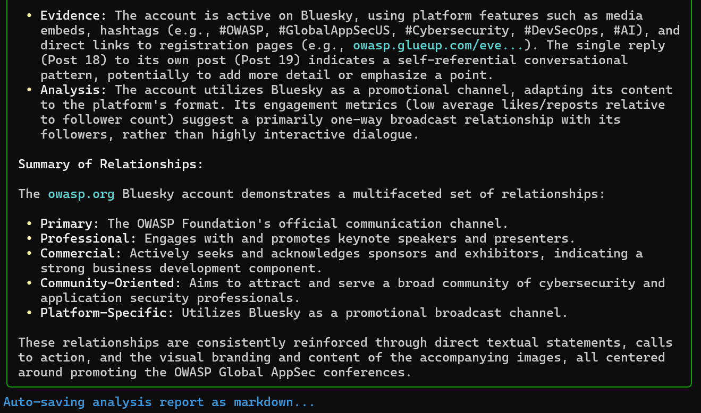
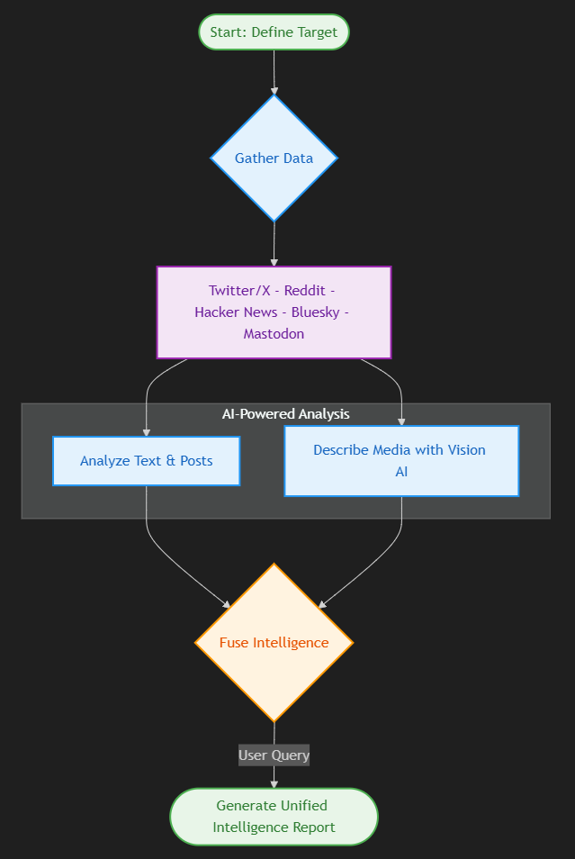

### What is SocialOSINTLM?

OWASP SocialOSINTLM is a powerful, Python-based tool that automates and enhances Open Source Intelligence (OSINT) gathering across major social media platforms, including **Twitter/X, Reddit, Hacker News, Bluesky, and Mastodon**. It provides security professionals and researchers with a unified, actionable view of a target's digital footprint by uncovering behavioral patterns, interests, and potential connections from both text and image data.

### Core Features

*   **Comprehensive Data Aggregation:** Gathers data simultaneously from Twitter/X, Reddit, Hacker News (via Algolia), Bluesky, and Mastodon. It interacts exclusively with official platform APIs, ensuring reliable and ethical data collection.
*   **Advanced AI Analysis:**
    *   **Text & Vision:** Leverages Large Language Models (LLMs) and Vision Models to analyze text for semantic content and images for objective details like locations, objects, and text.
    *   **Shared Domain Analysis:** Automatically extracts, counts, and summarizes external links to reveal a target's primary information sources and influences.
    *   **Accurate Temporal Context:** Injects the current UTC timestamp into every analysis prompt, forcing the LLM to correctly interpret the timeline of events and avoid errors based on its fixed knowledge cutoff date.
*   **Flexible & Resilient Operation:**
    *   **Interactive & Programmatic Modes:** Supports both a user-friendly interactive CLI for guided analysis and a programmatic (JSON-based) mode for integration into automated workflows.
    *   **Offline Mode:** Enables analysis to be run exclusively on locally cached data, eliminating the need for network requests to social platforms or for new media analysis.
    *   **Granular Fetch Control:** Interactively fetch more data for specific targets on-the-fly or define a detailed "Fetch Plan" in programmatic mode.
*   **Efficient and User-Friendly:**
    *   **Robust Caching:** Features a smart caching system to minimize API calls, along with interactive commands to view cache status and purge data.
    *   **Intelligent Rate-Limit Handling:** Detects API rate limits, provides informative feedback with reset times, and prevents lockouts.

### AI-Powered Conversational Analysis

SocialOSINTLM operates like a conversational analyst. Instead of producing a single, fixed report, you provide natural language queries to investigate the aggregated data from different angles. This allows for flexible and deep investigations tailored to your specific intelligence requirements.

You can ask the tool to:
*   **Analyze behavior:** "What are the user's primary hours of activity?"
*   **Identify topics:** "Summarize the main themes from the last month's posts."
*   **Assess persona:** "Are there notable differences in communication style between the Twitter and Bluesky accounts?"
*   **Map networks:** "Highlight any relationships with other users or organizations."

The report below was generated in response to the specific query: **"Highlight any relationships."**

### High-Level Workflow

The tool follows a structured process to gather and analyze data, which is then interrogated by a user's query to produce a tailored intelligence report.

### Project Status & Roadmap

The core functionality of SocialOSINTLM is mature and stable. Future development will focus on quality-of-life enhancements and expanding capabilities.

**Potential Future Work:**
*   Development of a graphical user interface (GUI) for enhanced usability.
*   Integration with additional social media platforms and data sources.
*   Advanced timeline and network visualization features.

### Resources

*   **GitHub Repository:** [View the source code on GitHub](https://github.com/bm-github/owasp-social-osintlm)
*   **Installation & Usage:** For detailed setup and command-line instructions, please see the [README.md](https://github.com/bm-github/owasp-social-osintlm/blob/main/README.md) file.
*   **Report an Issue:** Found a bug or have a feature request? [Open an issue](https://github.com/bm-github/owasp-social-osintlm/issues)